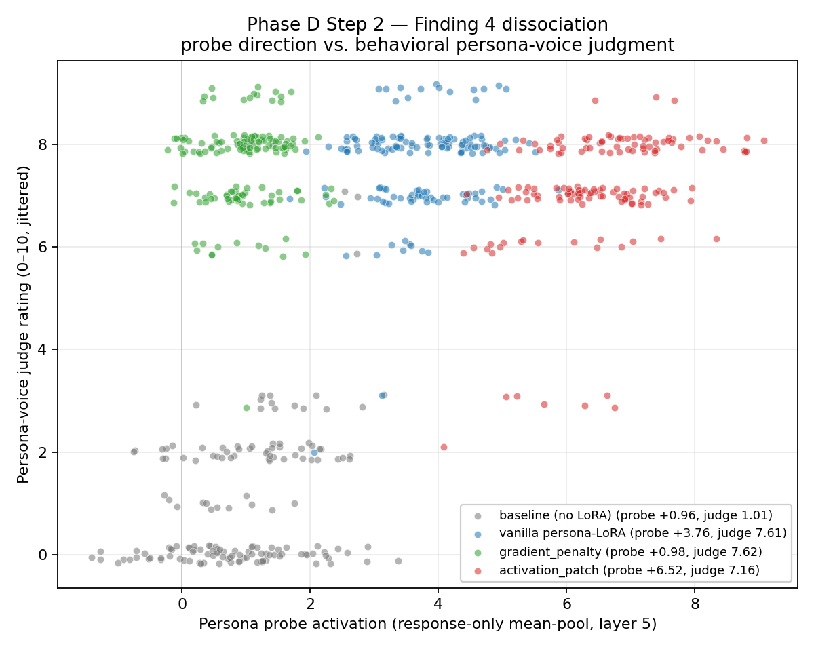

# Phase D Step 2 — Finding 4 behavioral judge summary

Judge: `claude-haiku-4-5`

## Per-condition aggregate (n = number with both probe and judge)

| Condition | n | Probe (mean ± SD) | Judge (mean ± SD) | r(probe, judge) |
|---|---:|---:|---:|---:|
| baseline (no LoRA) | 160 | +0.956 ± 1.001 | 1.01 ± 1.33 | +0.342 |
| vanilla persona-LoRA | 160 | +3.759 ± 0.796 | 7.61 ± 0.92 | +0.198 |
| gradient_penalty | 160 | +0.976 ± 0.551 | 7.62 ± 0.83 | +0.032 |
| activation_patch | 160 | +6.520 ± 0.993 | 7.16 ± 1.15 | +0.381 |

## Pairwise vs. baseline (independent Cohen's d, pooled SD)

| Comparison | mean Δ | pooled SD | Cohen's d |
|---|---:|---:|---:|
| none_vs_baseline_judge | +6.606 | 1.142 | +5.783 |
| none_vs_baseline_probe | +2.803 | 0.904 | +3.100 |
| gradient_penalty_vs_baseline_judge | +6.619 | 1.108 | +5.973 |
| gradient_penalty_vs_baseline_probe | +0.021 | 0.808 | +0.026 |
| activation_patch_vs_baseline_judge | +6.150 | 1.244 | +4.944 |
| activation_patch_vs_baseline_probe | +5.565 | 0.997 | +5.582 |

## Probe-vs-judge dissociation (z-scored against baseline)

`z_gap = mean(z_judge) − mean(z_probe)` per condition.  z_gap ≈ 0 means probe and judge move together; z_gap >> 0 means persona-voice is high on the judge axis while the probe axis is lower — the Finding 4 dissociation.

| Condition | z(probe) mean | z(judge) mean | z_gap |
|---|---:|---:|---:|
| baseline (no LoRA) | +0.000 | -0.000 | -0.000 |
| vanilla persona-LoRA | +2.801 | +4.969 | +2.168 |
| gradient_penalty | +0.021 | +4.979 | +4.958 |
| activation_patch | +5.560 | +4.626 | -0.934 |

## Plot

